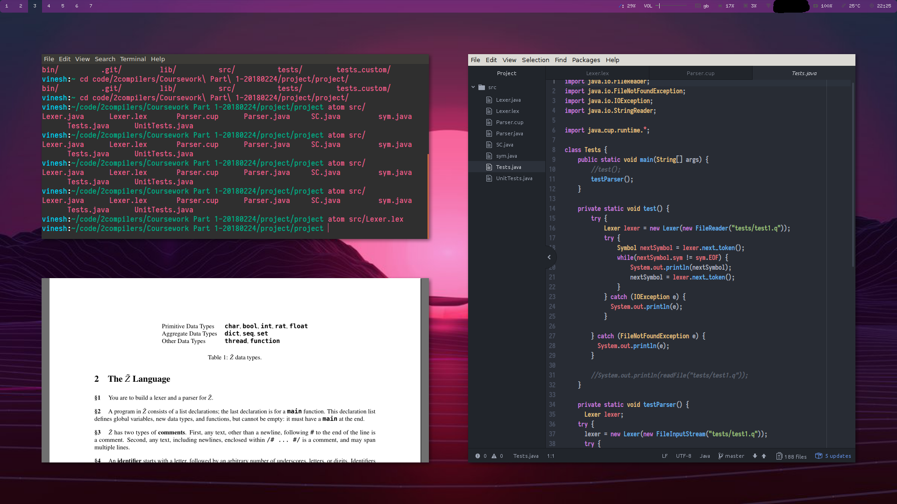
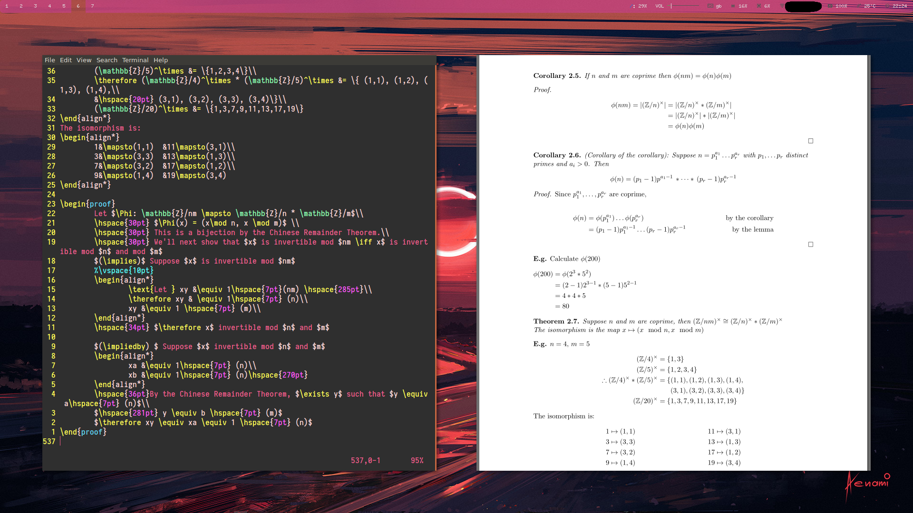
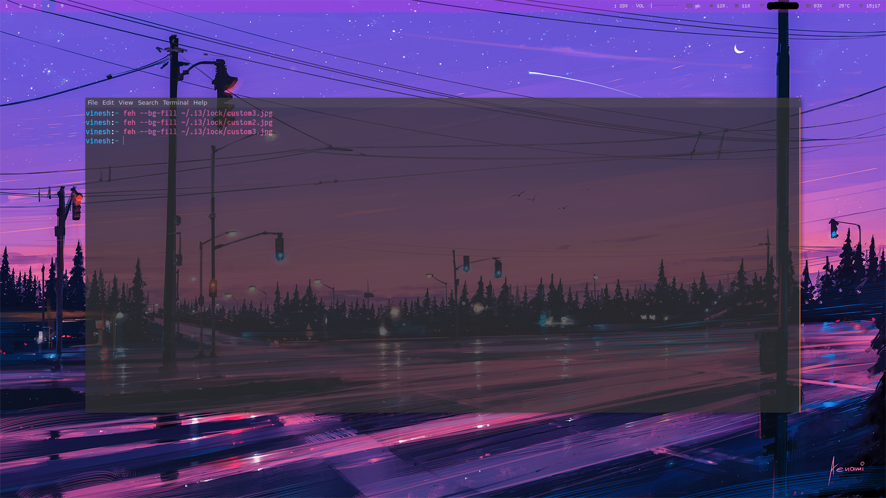

# dotfiles
      RICING IS FUN
                U
                N
                            C I T E H T S E A 
                         I               E  E                                                   
                      T               S     S                                                                     
                   E               T        T                                                                                                                                                
                H               H           H                                                                                                                                                                                                                                             
             T               E              E                                                                                                                                               
          S               T                 T 
       E               I                    I
    A E S T H E T I C                       C
    E E             I                    I                                          
    S   S           T                 T      
    T     T         E              E         
    H       H       H           H            
    E         E     T        T               
    T           T   S     S                  
    I             I E  E                     
    C I T E H T S E A  
    
Running \[i3-gaps, compton, polybar, i3-lock\] + various other repos to fix and get things to work on my laptop
    
TO DO:
Add screenshots (gifs too?) to show off the sweet setup  

Here's an example of me working on a project, and yes, I work with gaps enabled :)  

Did I tell you I can compile LaTeX documents in real time? Courtesy of Vim and Vim-live-latex-preview  

Lock screen - works by screenshotting the current workspace, pixelating everything and overlaying the lock screen image on top
  

Transparency also works on i3! woooooo

                  

